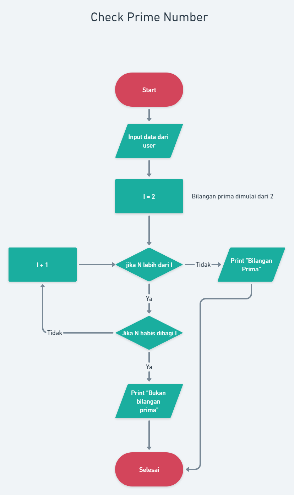
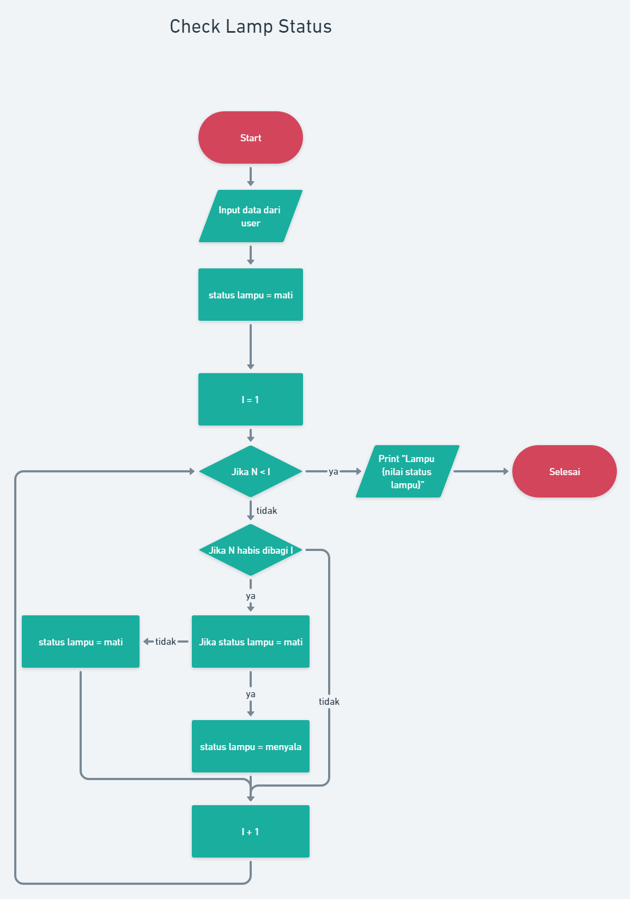

# Praktikum

Link [Whimsical](https://whimsical.com/algoritma-rafli-GD4Mx5ZsrJbv39TRb67pTJ)

### Tahapan check prime number:

> Prinsip: Bilangan prima adalah bilangan yang hanya memiliki dua faktor, yaitu bilangan 1 dan bilangan itu sendiri

1. User menginput angka ke dalam sistem (N)
2. Pendefinisikan variabel I dengan nilai 2 karena bilangan prima dimulai dari 2
3. Pengecekan apakah nilai input (N) lebih dari I. Jika tidak, maka nilai tersebut akan dianggap bilangan prima. Namun jika iya, maka proses akan dilanjutkan
4. Pengecekan apakah nilai input (N) dapat habis dibagi I. Jika iya, maka bilangan tersebut dapat dipastikan bilangan bukan prima. Jika tidak, maka nilai I akan ditambah 1 dan terjadi looping ke tahap ketiga hingga nilai N lebih dari I.
5. Mencetak nilai
6. Selesai

### Check Lamp Status

> Prinsip: Jika bilangan iterasi tersebut merupakan nilai faktorial dari input (N) maka status lampu akan berubah

1. User memasukan input angka (N)
2. Mendefinisikan status lampu dengan nilai mati
3. Mendefinisikan variabel iterasi (I) dengan nilai 1
4. Pengecekan apakah nilai I lebih besar dari N. Jika iya, maka akan mencetak nilai “Lampu” + nilai status lampu. Jika tidak, maka proses akan dilanjutkan
5. Pengecekan apakan nilai N dapat habis dibagi I. Jika tidak, maka nilai I langsung ditambah 1.
6. Pengecekan apakah nilai status lampu adalah mati. Jika iya, maka nilai statusnya akan berubah menjadi menyala. Namun jika tidak, maka nilai statusnya diubah menjadi mati
7. nilai I ditambah 1, kemudian melakukan looping pada proses keempat hingga nilai I lebih besar dari N.
8. Cetak nilai “Lampu “ + nilai status lampu
9. Selesai

